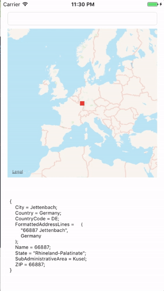
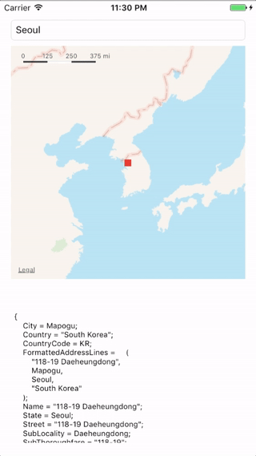

[](http://cocoapods.org/pods/TezGeocoder)
[]()
[](http://cocoapods.org/pods/TezGeocoder)
[](http://cocoapods.org/pods/TezGeocoder)
[](https://travis-ci.org/tezpark/TezGeocoder)

# TezGeocoder
Geocoding and reverse-geocoding

## Summary
* To support geocoding and reverse geocoding.
* This library only uses the iOS framework (CoreLocation, Contacts)
* Geocoding
  * Coordinate(latitude, longitude) -> Address information
* Reverse-geocoding
  * Address information -> Coordinate(latitude, longitude)

## Screenshots



## Requirements
* iOS SDK >= 8.0

## Installation
#### CocoaPods
TezGeocoder is available through [CocoaPods](http://cocoapods.org). To install
it, simply add the following line to your Podfile:

```ruby
pod "TezGeocoder"
```

## Usage
```objective-c
// Geocoding (Get coordinate with address info)
CLLocationCoordinate2D coordinate = CLLocationCoordinate2DMake(37.499378, 127.043054);
TezGeocoder* reverseGeocoder = [[TezGeocoder alloc] initWithLatitude:coordinate.latitude longitude:coordinate.longitude];
NSLog(@"(%@) %@ %@ %@ %@ %@ %@ %@",
      [reverseGeocoder postalCode],
      [reverseGeocoder country],
      [reverseGeocoder countryCode],
      [reverseGeocoder state],
      [reverseGeocoder city],
      [reverseGeocoder street],
      [reverseGeocoder subStreet],
      [reverseGeocoder name]);
      

// Geocoding (Get address info with coordinate)
NSString *addressStr = @"Yeoksam-dong ,Gangnam-gu, Seoul";
TezGeocoder *geocoder = [[TezGeocoder alloc] initWithAddressString:addressStr];
NSLog(@"lat:%f lon:%f", geocoder.location.coordinate.latitude, geocoder.location.coordinate.longitude);    
```


## Author

TezPark, ptswin@gmail.com

## License

TezGeocoder is available under the MIT license. See the LICENSE file for more info.
